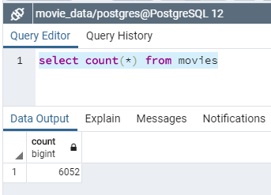

# Movies_ETL


## Analysis
The overall goals of this ETL creation was to create the data sets that will be used during the Amazing Prime Hackathon event. This process leveraged data from data from both Wikipedia and Kaggle. Merged and transformed each data set, then loaded the result to a Postgres database.

#### Observations
- A significant observation of the Data was that the kaggle data was more uniform and cleaner data
- The average rating for this movie set is 5.9 which is just above the middle of the scale

#### Assumptions
- Removed Adult films as the content is not appropriate for the event
- Very small subsets of data were ignored/dropped where there would NOT be a significant impact to the analysis or data was indeciferable
- The regular expresssions should handle the vast majority of variations. However they cannot handle ALL potential variations. Future data sets may require an update to the expression
- The alternate language titles would not be needed in the cleaned data set. There were removed, but stored in a dictionary should the need to use them arise
    


### Table summarizes merge decisions with high level justifications

```python
# Table summarizes merge decision with high level justifications

# Competing data:
# Wiki                     Movielens                Resolution
#--------------------------------------------------------------------------
# title_wiki               title_kaggle             Drop Wikipedia (kaggle slightly more consistent)
# running_time             runtime                  Keep Kaggle; fill in zeros with Wikipedia data. (wiki data had more outliers on histogram)
# budget_wiki              budget_kaggle            Keep Kaggle; fill in zeros with Wikipedia data. (wiki data had more outliers on histogram)
# box_office               revenue                  Keep Kaggle; fill in zeros with Wikipedia data.
# release_date_wiki        release_date_kaggle      Drop Wikipedia (kaggle data clean while wiki has missing data)
# Language                 original_language        Drop Wikipedia (kaggle is cleaner & more consistent)
# Production company(s)    production_companies     Drop Wikipedia (kaggle is cleaner & more consistent)
```

## Created a "Movies_ETL" function that takes in three arguments (dataframes):
- Wikipedia data
- Kaggle metadata
- MovieLens rating data (from Kaggle)

Function performs necessary transformation steps then loads resulting data to a Postgres DB

All exploratory data analysis code has been trimmmed

Links to data sets used:
[Movies Metadata](https://drive.google.com/drive/folders/1nlzu_j7yt83nOsay4JrguKnHyUJlMKTd?usp=sharing)
[Ratings](https://drive.google.com/drive/folders/1nlzu_j7yt83nOsay4JrguKnHyUJlMKTd?usp=sharing)


## Miscellaneous 
- Loading to Postgres wrapped in try-except block. Using if_exists='replace' to over-write the table if it already exists


```python
try:
    movies_df.to_sql(name='movies', con=engine, if_exists='replace')
except Exception as ex: 
    print(type(ex).__name__)
    print("Error loading to Postgres")
```
