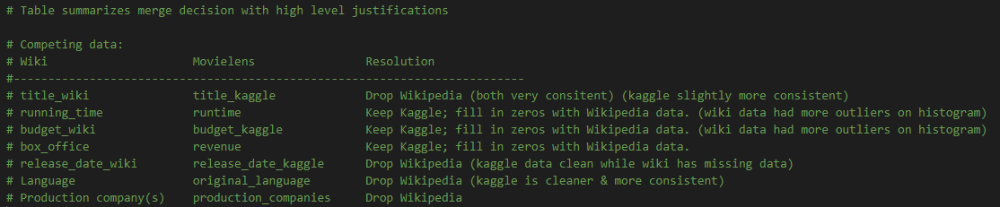

# Movies_ETL


## Created a "Movies_ETL" function that takes in three arguments:
- Wikipedia data
- Kaggle metadata
- MovieLens rating data (from Kaggle)

Function performs necessary transformation steps then loads resulting data to a Postgres DB

All exploratory data analysis and redundant code has been trimmmed


## Assumptions and rational discussion:


### Table summarizes merge decision with high level justifications


```
# Table summarizes merge decision with high level justifications

# Competing data:
# Wiki                     Movielens                Resolution
#--------------------------------------------------------------------------
# title_wiki               title_kaggle             Drop Wikipedia (both very consitent) (kaggle slightly more consistent)
# running_time             runtime                  Keep Kaggle; fill in zeros with Wikipedia data. (wiki data had more outliers on histogram)
# budget_wiki              budget_kaggle            Keep Kaggle; fill in zeros with Wikipedia data. (wiki data had more outliers on histogram)
# box_office               revenue                  Keep Kaggle; fill in zeros with Wikipedia data.
# release_date_wiki        release_date_kaggle      Drop Wikipedia (kaggle data clean while wiki has missing data)
# Language                 original_language        Drop Wikipedia (kaggle is cleaner & more consistent)
# Production company(s)    production_companies     Drop Wikipedia

```


Try-except blocks used to account for unforeseen problems that may arise with new data.